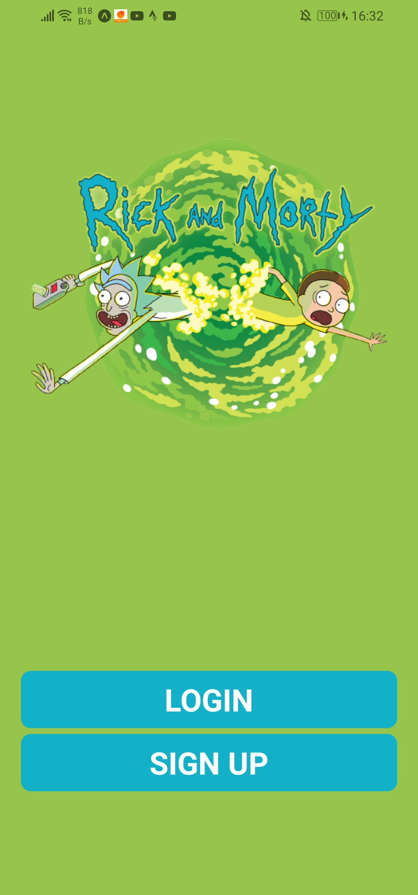
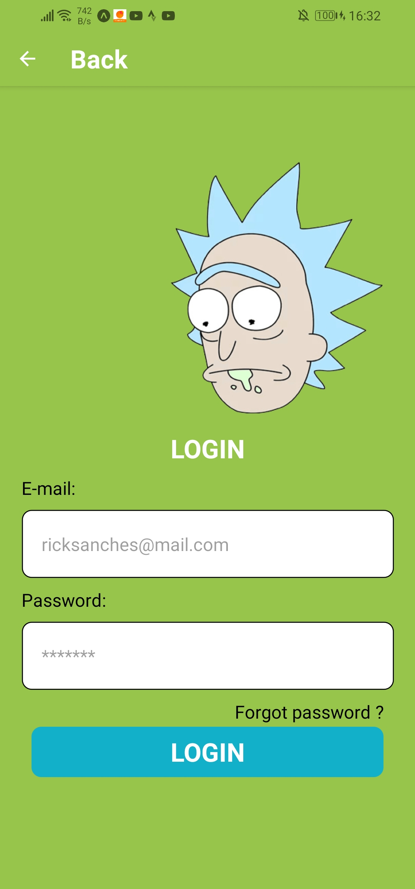
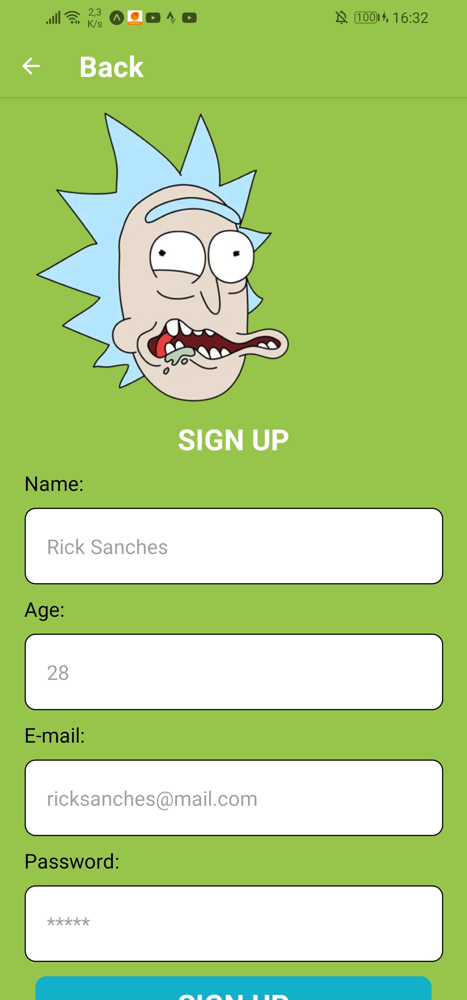
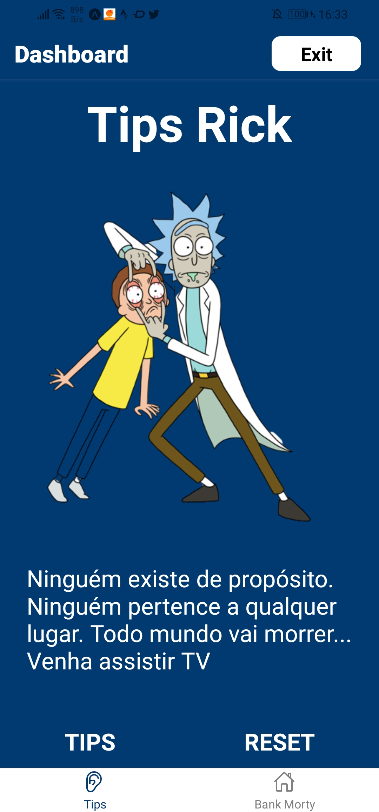
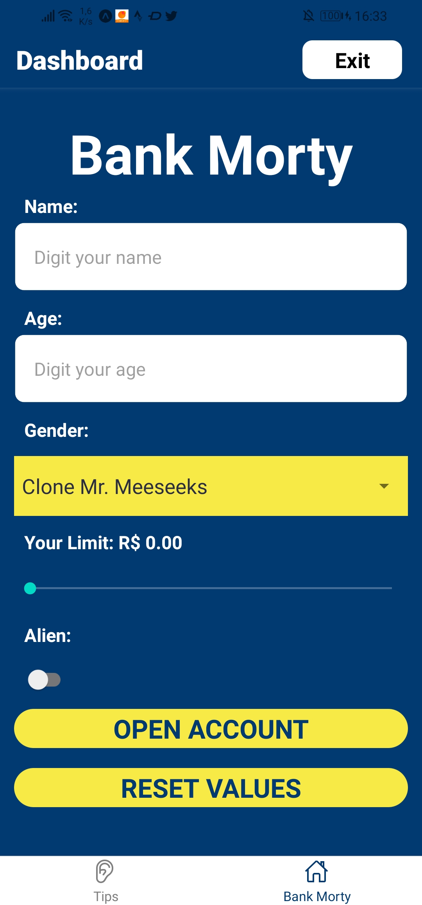

# Trabalho Final Mobile

🎓 College: [Faculdade Metodista Granbery](http://granbery.edu.br/)

👨‍🏫 Teacher: [Érica Carvalho - Github](https://github.com/ericacrcarvalho) | [Linkedin](https://www.linkedin.com/in/ericacrcarvalho/)

---

### Disciplina: Introdução ao Desenvolvimento Mobile
### Data de entrega: 05/06/22 (via AVA) - Data de apresentação: 06/06/22
#### Valor: 4 pontos
#### Tema: Sugestão da professora ou tema escolhido pelo grupo

---

## Sugestão de 

Criar uma aplicação que contenha uma tela de login e cadastro inserindo animações.

Deverão ser criadas pelo menos 4 telas, sendo que uma tela deve ser o app da Avaliação 1 e outra tela o app da Avaliação 2.

#### Na tela inicial devem conter os seguintes itens:
- Logo da empresa/tema
- Dois campos para preenchimento do usuário e senha
- Um botão para logar/acessar
- Um botão para cadastrar novo usuário

### Obs:
- Toda aplicação deve ser testada no celular.
- Ao carregar a tela inicial, deve haver uma animação na View contendo os campos de usuário e senha e os botões de login e cadastrar.
- Ao digitar o usuário, quando o teclado abrir, o logo deve diminuir, quando o teclado fechar, o logo deve voltar ao tamanho original.

--- 

### Na tela de cadastro devem conter os seguintes itens:
- Um campo para inserir o novo usuário
- Um campo para inserir a senha
### Obs:
- Deve haver pelo menos duas animações na tela de cadastro.

Após o cadastro de um novo usuário, deve ser redirecionado para a tela inicial. Após o login (sem nenhum tipo de verificação), deve ser redirecionado para uma nova tela que deve conter a navegação Tabs com, no mínimo, duas telas:

- Home: o conteúdo desta tela fica a critério do aluno
- App da Avaliação 1 (obrigatória).
- App da Avaliação 2 (obrigatória).
- Outra(s) tela(s) qual(is)quer (opcional).
- Em cada uma dessas telas deve conter pelo menos uma animação (View, Text,
Image, etc)

---

### Os seguintes elementos devem estar presentes no código:
- O código deve estar organizado e legível. Devem ser criadas pastas destinadas para cada “parte” do código: componentes, imagens, telas, rotas, etc.
- As cores e os tamanhos devem estar em um arquivo separado (ex.: colors.js e sizes.js)
- Os botões e os inputs de texto, etc. devem ser um componente sem estado (ex.: MyButton.js e MyTextInput.js)
____________________________________________________________________
### Informações importantes:
Todo o conteúdo apresentado em aula deve ser utilizado no trabalho:
- Componentes React Native
- React Hooks (useState, useEffect, useContext)
- Navegação
- Animação
- Qualquer conteúdo extra será validado.
____________________________________________________________________
Observações:
- O trabalho deve ser feito em grupo e não é permitido copiar o trabalho do outro
grupo. Se isso ocorrer, a nota será dividida pelo total de alunos envolvidos na cópia.
- O link do Github contendo o trabalho (ou o arquivo compactado) deve ser enviado
pelo AVA até as 23h do dia 05/06/22.
- Todos os alunos deverão apresentar o trabalho na data combinada.
- Qualquer dúvida/problema, entrar em contato por e-mail.

### Screens

### Referências

[freepnglogos](https://www.freepnglogos.com/images/rick-and-morty-31013.html)

[freepnglogos](https://www.freepnglogos.com/images/rick-and-morty-30969.html)

[freepnglogos](https://www.freepnglogos.com/pics/rick-and-morty)

[pensador](https://www.pensador.com/autor/rick_and_morty/)

[subpng](https://www.subpng.com/png-667jk2/)

[kissclipart](https://www.kissclipart.com/rick-sanchez-rick-and-morty-clipart-rick-sanchez-m-u2wtry/)

[subpng](https://www.subpng.com/png-pat8a4/)

[subpng](https://www.subpng.com/png-goara7/)
